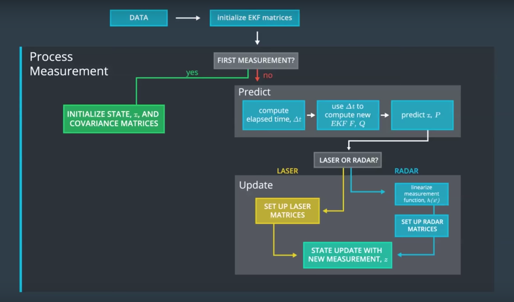
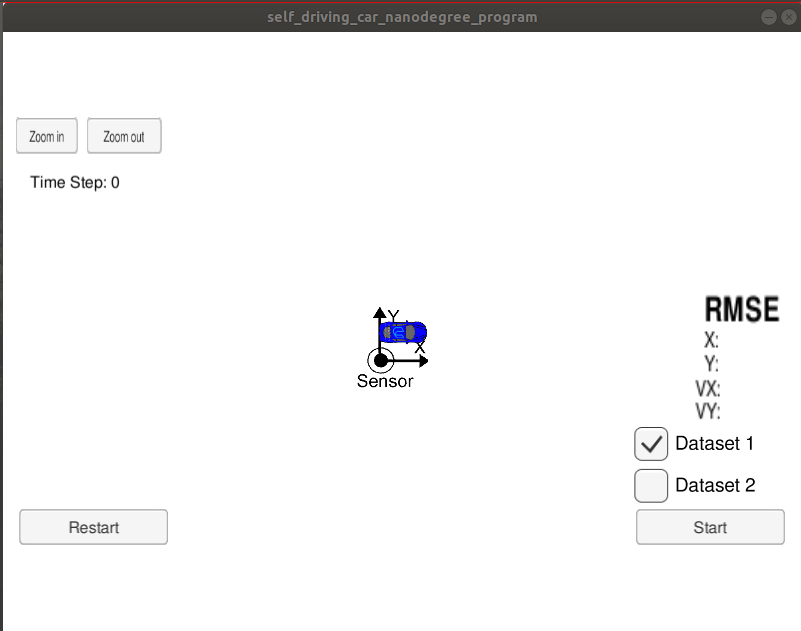
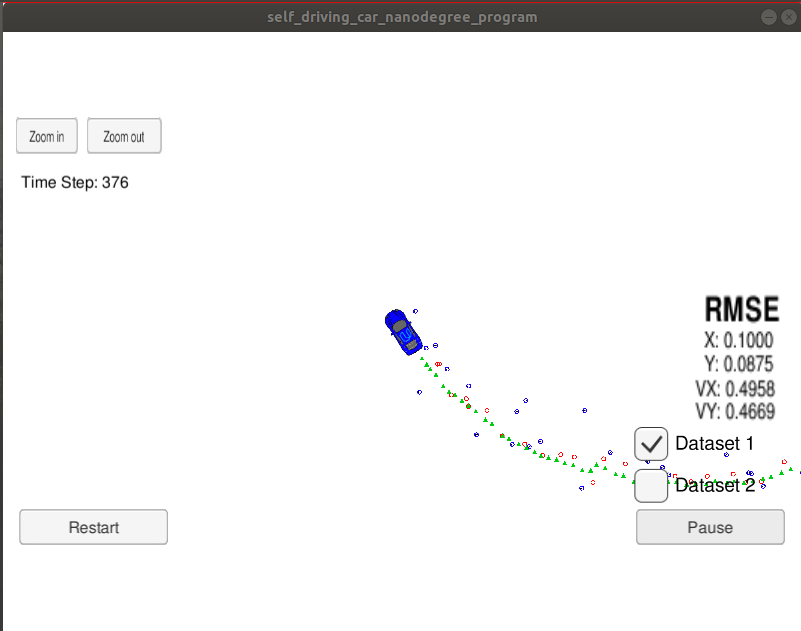
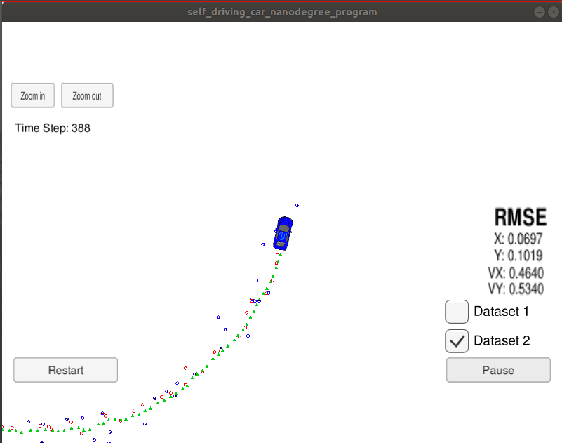

# Extended Kalman Filter Project Starter Code
Self-Driving Car Engineer Nanodegree Program

This project involves the Term 2 Simulator which can be downloaded [here](https://github.com/udacity/self-driving-car-sim/releases)

This repository includes two files that can be used to set up and install [uWebSocketIO](https://github.com/uWebSockets/uWebSockets) for either Linux or Mac systems. For windows you can use either Docker, VMware, or even [Windows 10 Bash on Ubuntu](https://www.howtogeek.com/249966/how-to-install-and-use-the-linux-bash-shell-on-windows-10/) to install uWebSocketIO. Please see [this concept in the classroom](https://classroom.udacity.com/nanodegrees/nd013/parts/40f38239-66b6-46ec-ae68-03afd8a601c8/modules/0949fca6-b379-42af-a919-ee50aa304e6a/lessons/f758c44c-5e40-4e01-93b5-1a82aa4e044f/concepts/16cf4a78-4fc7-49e1-8621-3450ca938b77) for the required version and installation scripts.

Once the install for uWebSocketIO is complete, the main program can be built and run by doing the following from the project top directory.

1. mkdir build
2. cd build
3. cmake ..
4. make
5. ./ExtendedKF

Tips for setting up your environment can be found [here](https://classroom.udacity.com/nanodegrees/nd013/parts/40f38239-66b6-46ec-ae68-03afd8a601c8/modules/0949fca6-b379-42af-a919-ee50aa304e6a/lessons/f758c44c-5e40-4e01-93b5-1a82aa4e044f/concepts/23d376c7-0195-4276-bdf0-e02f1f3c665d)

---

### How the EKF has been here implemented
The following flow-chart has been used to implement the EKF:

The 3 major steps are <br>
  * <b>1. Initialize the matrices</b> <br>
  We will fed the algorithm with the first measurement, and the corresponding uncertainty for the initial start. This will only happen at the beginning, since once the algorithm is "launched", we will use the computed error of the next estimate as input. 


  * <b>2. Predict the state</b> <br>
  We then predict the new state based on the previous estimate and the measured value (input data).


  * <b>3. Update the state</b> <br>
  The state is updated and a new error estimate is computed. This new error is then fed to step 1). 

---

## Other Important Dependencies

* cmake >= 3.5
  * All OSes: [click here for installation instructions](https://cmake.org/install/)
* make >= 4.1 (Linux, Mac), 3.81 (Windows)
  * Linux: make is installed by default on most Linux distros
  * Mac: [install Xcode command line tools to get make](https://developer.apple.com/xcode/features/)
  * Windows: [Click here for installation instructions](http://gnuwin32.sourceforge.net/packages/make.htm)
* gcc/g++ >= 5.4
  * Linux: gcc / g++ is installed by default on most Linux distros
  * Mac: same deal as make - [install Xcode command line tools](https://developer.apple.com/xcode/features/)
  * Windows: recommend using [MinGW](http://www.mingw.org/)

## Basic Build Instructions

1. Clone this repo.
2. Make a build directory: `mkdir build && cd build`
3. Compile: `cmake .. && make` 
   * On windows, you may need to run: `cmake .. -G "Unix Makefiles" && make`
4. Run it: `./ExtendedKF `

---

## Running the Filter

From the build directory, execute `./ExtendedKF`. The output should be:

```
Listening to port 4567
Connected!!!
```

As you can see, the simulator connect to it right away.

The following is an image of the simulator:



The simulator provides two datasets. The difference between them are:

- The direction the car (the object) is moving.
- The order the first measurement is sent to the EKF. On dataset 1, the LIDAR measurement is sent first. On the dataset 2, the RADAR measurement is sent first.

Here is the simulator final state after running the EKL with dataset 1:



Here is the simulator final state after running the EKL with dataset 2:



---

## Demo Video

[](https://youtu.be/rABgz4heQf4)

